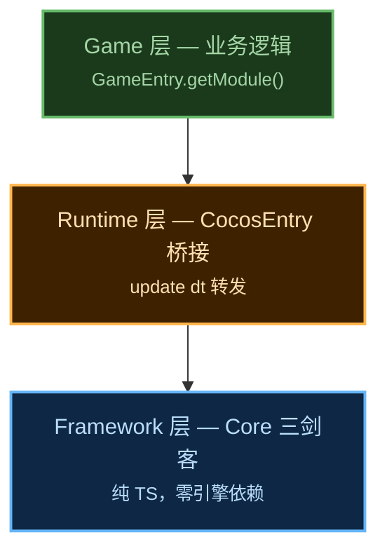

# Obsidian 模块学习笔记规范

当一个框架模块完成（代码 + 测试 + Review 通过）后，必须为该模块生成一篇 Obsidian 学习笔记。

## 触发时机

- coach agent 完成模块教学后，自动调用 narrative-writer agent 写笔记
- 用户手动要求 "写笔记" / "记录到 Obsidian"

## 写作流程

1. **coach agent** 用五步法生成教学内容（概念引入 → 原理讲解 → 框架适配 → 优缺点 → 理解检查）
2. **narrative-writer agent** 将教学内容转化为叙事式 Obsidian 笔记

允许 coach agent 在完成教学后直接调用 narrative-writer agent。

## 范文路径

所有已完成的笔记存放于 Obsidian vault：

```
/Volumes/Extreme SSD/BigroundObsidianVault/开发相关/
├── GameForge Cinder 框架总览：为什么我们需要一个游戏框架.md  ← 索引页
└── GameForge Cinder/
    ├── 01-Core 模块：游戏框架的心脏.md
    ├── 02-Event 模块：解耦的艺术.md
    ├── 03-ObjectPool 模块：驯服 GC 的艺术.md
    ├── 04-DI 容器：谁来控制控制者.md
    ├── 05-FSM 模块：让角色活起来的状态机.md
    └── 06-Procedure 模块：游戏流程的总导演.md
```

写新笔记前**必须先读 1-2 篇范文**，模仿其结构、语气和格式。

## 笔记规范

### YAML Frontmatter（必须）

```yaml
---
date: YYYY-MM-DD
tags: [game-framework, cocos-creator, <module-specific-tags>]
publish: true
type: learning
status: reviewed
---
```

### 叙事结构（必须遵循）

**场景** → **冲突** → **探索** → **发现**

1. **场景**：用一个具体的游戏开发痛点引入（反面代码示例）
2. **冲突**：为什么直觉做法会失败（复杂度爆炸、性能问题、维护噩梦）
3. **探索**：模块的设计原理、关键数据结构、核心算法
4. **发现**：行动指南 + 自测三问

### 图表规则（铁律）

- **禁止** ASCII box-drawing 图（`┌─┐│└─┘` 等字符画）
- **禁止** Mermaid `block-beta` 语法（Obsidian 兼容性差）
- **必须** 使用 Mermaid `graph TB` / `graph LR` 绘制所有架构图、流程图、层级图
- 用 `style` 着色区分层级，用 `<small>` 标签降低副文本视觉权重
- 示例：

````markdown

````

### Obsidian 特性（必须使用）

- `[[wikilinks]]` 链接到系列其他笔记
- `> [!tip]` / `> [!warning]` / `> [!question]` callout blocks
- 代码块用 TypeScript 语法高亮

### 命名约定

```
{序号:两位数}-{模块名}：{副标题}.md
```

示例：`07-Resource 模块：从加载到释放的全生命周期.md`

### 互联

每篇笔记底部必须有 `## 相关笔记` 章节，用 wikilinks 链接到系列其他笔记。
