# 🎮 Forge Blaze Ignite — 综合 Demo Series 设计文档

> **版本**：v1.0 | **创建日期**：2026-04-20
> **目的**：为 Phase 4 综合 Demo 提供完整设计蓝图，每个 Demo 可由独立 worktree + session 开发

---

## 1. 总览

### 1.1 目标

通过 **6 个完整游戏 Demo + 1 套共享基础设施**，验证 Forge Blaze Ignite 全部 17 个框架模块在真实游戏场景下的协作能力，同时为面试积累深度项目经验。

### 1.2 设计原则

1. **质量优先**：每个 Demo 设计充分，覆盖核心玩法循环，不做"hello world"级别的演示
2. **独立开发**：每个 Demo 在独立 worktree + session 中开发，设计文档提供足够的自包含上下文
3. **网络用 Mock**：所有网络通信通过 `MockNetworkSocket` 模拟延迟和消息转发，不依赖真实服务器
4. **展示层纯 HTML**：彩色日志输出 + 按钮交互，不引入 UI 框架
5. **17 模块 100% 覆盖**：每个模块至少在一个 Demo 中深度使用
6. **每个 Demo 配集成测试**：验证模块间协作的端到端测试

### 1.3 Demo 列表

| #   | 名称                | 类型         | 核心验证点                               |
| --- | ------------------- | ------------ | ---------------------------------------- |
| 0   | Demo Infrastructure | 共享基础设施 | Mock 策略、HtmlRenderer、DemoBase        |
| 1   | Idle Clicker        | 挂机放置     | Timer 深度、DataTable 配置驱动、数值成长 |
| 2   | Turn-based RPG      | 回合制 RPG   | FSM 战斗、Procedure 流程、Entity 管理    |
| 3   | Auto-chess Lite     | 自走棋       | Entity 大量管理、ObjectPool 复用、AI FSM |
| 4   | Tactics Grid        | 战棋         | FSM 多层嵌套、网格地图、地形系统         |
| 5   | Multiplayer Arena   | 多人对战     | Network 深度、状态同步、重连恢复         |
| 6   | Game Launcher       | 游戏启动器   | HotUpdate、Scene 切换、i18n、全模块串联  |

### 1.4 共用约定

#### 文件结构

```
assets/scripts/game/
├── shared/                    # Demo Infrastructure（Demo 0）
│   ├── DemoBase.ts            # 所有 Demo 的基类
│   ├── HtmlRenderer.ts        # HTML 日志 + 按钮渲染器
│   ├── MockResourceLoader.ts  # 资源加载 Mock
│   ├── MockAudioPlayer.ts     # 音频播放 Mock
│   ├── MockSceneLoader.ts     # 场景加载 Mock
│   ├── MockNetworkSocket.ts   # 网络 Socket Mock（含延迟模拟）
│   ├── MockUIFormFactory.ts   # UI 表单工厂 Mock
│   ├── MockEntityFactory.ts   # 实体工厂 Mock
│   ├── MockHotUpdateAdapter.ts # 热更新适配器 Mock
│   └── MockLocalizationLoader.ts # 本地化加载器 Mock
├── demo1-idle/                # Idle Clicker
├── demo2-rpg/                 # Turn-based RPG
├── demo3-autochess/           # Auto-chess Lite
├── demo4-tactics/             # Tactics Grid
├── demo5-arena/               # Multiplayer Arena
└── demo6-launcher/            # Game Launcher
```

#### 测试文件结构

```
tests/integration/
├── demo1-idle.integration.test.ts
├── demo2-rpg.integration.test.ts
├── demo3-autochess.integration.test.ts
├── demo4-tactics.integration.test.ts
├── demo5-arena.integration.test.ts
└── demo6-launcher.integration.test.ts
```

#### 模块注册约定

所有 Demo 共用同一套 `GameEntry` 注册流程，通过 `DemoBase.bootstrap()` 统一初始化：

```typescript
// DemoBase.bootstrap() 内部执行：
GameEntry.registerModule(eventManager); // priority: 10
GameEntry.registerModule(objectPool); // priority: 20
GameEntry.registerModule(timerManager); // priority: 30
GameEntry.registerModule(logger); // priority: 0
GameEntry.registerModule(fsmManager); // priority: 100
GameEntry.registerModule(procedureManager); // priority: 300
GameEntry.registerModule(resourceManager); // priority: 110
GameEntry.registerModule(audioManager); // priority: 200
GameEntry.registerModule(sceneManager); // priority: 210
GameEntry.registerModule(uiManager); // priority: 220
GameEntry.registerModule(entityManager); // priority: 230
GameEntry.registerModule(networkManager); // priority: 120
GameEntry.registerModule(dataTableManager); // priority: 310
GameEntry.registerModule(localizationManager); // priority: 320
GameEntry.registerModule(debugManager); // priority: 400
GameEntry.registerModule(hotUpdateManager); // priority: 130
```

#### 日志颜色规范

| 颜色  | 用途              | CSS              |
| ----- | ----------------- | ---------------- |
| 🟢 绿 | 成功 / 初始化完成 | `color: #4CAF50` |
| 🔵 蓝 | 信息 / 状态变化   | `color: #2196F3` |
| 🟡 黄 | 警告 / 资源释放   | `color: #FF9800` |
| 🔴 红 | 错误 / 断线       | `color: #F44336` |
| 🟣 紫 | 网络消息          | `color: #9C27B0` |
| ⚪ 灰 | 调试 / 帧更新     | `color: #9E9E9E` |
| 🔶 橙 | 战斗 / 伤害数字   | `color: #FF5722` |
| 🩵 青 | 定时器 / 计时     | `color: #00BCD4` |

---

## 2. 模块覆盖矩阵

> ◉ = 深度使用（核心玩法依赖） ○ = 常规使用 · = 轻度/间接使用

| 模块                | D0 基础设施 | D1 Idle | D2 RPG | D3 Auto-chess | D4 Tactics | D5 Arena | D6 Launcher |
| ------------------- | :---------: | :-----: | :----: | :-----------: | :--------: | :------: | :---------: |
| Core                |      ◉      |    ○    |   ○    |       ○       |     ○      |    ○     |      ○      |
| EventManager        |      ◉      |    ◉    |   ◉    |       ◉       |     ◉      |    ◉     |      ○      |
| ObjectPool          |      ○      |    ○    |   ◉    |       ◉       |     ◉      |    ◉     |      ·      |
| DI/IoC              |      ◉      |    ○    |   ○    |       ○       |     ○      |    ○     |      ○      |
| FSM                 |      ·      |    ○    |   ◉    |       ◉       |     ◉      |    ◉     |      ·      |
| ProcedureManager    |      ·      |    ◉    |   ◉    |       ◉       |     ◉      |    ◉     |      ◉      |
| ResourceManager     |      ◉      |    ○    |   ○    |       ○       |     ○      |    ○     |      ○      |
| UIManager           |      ○      |    ◉    |   ◉    |       ○       |     ○      |    ○     |      ◉      |
| EntityManager       |      ○      |    ·    |   ◉    |       ◉       |     ◉      |    ◉     |      ·      |
| NetworkManager      |      ◉      |    ·    |   ·    |       ○       |     ·      |    ◉     |      ·      |
| AudioManager        |      ○      |    ○    |   ◉    |       ○       |     ○      |    ○     |      ○      |
| SceneManager        |      ○      |    ○    |   ○    |       ○       |     ○      |    ○     |      ◉      |
| TimerManager        |      ○      |    ◉    |   ○    |       ◉       |     ○      |    ◉     |      ·      |
| DataTableManager    |      ○      |    ◉    |   ◉    |       ◉       |     ◉      |    ○     |      ·      |
| LocalizationManager |      ○      |    ·    |   ○    |       ·       |     ·      |    ·     |      ◉      |
| Logger              |      ◉      |    ○    |   ○    |       ○       |     ○      |    ○     |      ○      |
| DebugManager        |      ◉      |    ○    |   ○    |       ○       |     ○      |    ○     |      ◉      |
| HotUpdateManager    |      ·      |    ·    |   ·    |       ·       |     ·      |    ·     |      ◉      |

**覆盖检查**：每个模块至少有 1 个 ◉（深度使用），确保 17 模块 100% 覆盖。

---

## 3. Demo 0 — Demo Infrastructure（共享基础设施）

### 3.1 概述

提供所有 Demo 共用的基础组件：Mock 策略实现、HTML 渲染器、Demo 基类。这不是一个游戏，而是其他 6 个 Demo 的共享依赖层。

### 3.2 核心组件

#### 3.2.1 DemoBase（Demo 基类）

```typescript
abstract class DemoBase {
    protected gameEntry: GameEntry;
    protected htmlRenderer: HtmlRenderer;

    /** 初始化框架所有模块，注入 Mock 策略 */
    async bootstrap(): Promise<void>;

    /** 子类实现：注册 Procedure 并启动 */
    abstract setupProcedures(): void;

    /** 子类实现：注册 DataTable 数据 */
    abstract setupDataTables(): void;

    /** 启动主循环（setInterval 模拟 update） */
    startMainLoop(fps?: number): void;

    /** 停止主循环 */
    stopMainLoop(): void;

    /** 获取模块的类型安全快捷方法 */
    protected getModule<T extends ModuleBase>(name: string): T;
}
```

#### 3.2.2 HtmlRenderer（HTML 渲染器）

```typescript
class HtmlRenderer {
    /** 添加带颜色的日志条目 */
    log(message: string, color?: string): void;

    /** 添加分隔线 */
    separator(title?: string): void;

    /** 创建按钮组（返回按钮容器） */
    createButtonGroup(groupName: string): HTMLElement;

    /** 在按钮组中添加按钮 */
    addButton(
        group: HTMLElement,
        label: string,
        onClick: () => void,
        disabled?: boolean,
    ): HTMLButtonElement;

    /** 清空日志区域 */
    clearLog(): void;

    /** 创建状态面板（显示键值对） */
    createStatusPanel(panelId: string, title: string): StatusPanel;

    /** 更新状态面板某个值 */
    updateStatus(panelId: string, key: string, value: string): void;

    /** 创建表格显示区域 */
    createTable(headers: string[], rows: string[][]): HTMLElement;
}
```

HTML 布局：

```
┌─────────────────────────────────────────────┐
│  [Demo 标题]                                │
├──────────────────┬──────────────────────────┤
│  状态面板区域     │  日志输出区域             │
│  (StatusPanel)   │  (彩色日志，自动滚动)     │
│                  │                          │
├──────────────────┴──────────────────────────┤
│  按钮操作区域                                │
│  [按钮1] [按钮2] [按钮3] ...                 │
└─────────────────────────────────────────────┘
```

#### 3.2.3 MockResourceLoader

```typescript
class MockResourceLoader implements IResourceLoader {
    /** 预设资源映射（path → asset 数据） */
    private _assets: Map<string, unknown>;

    /** 模拟加载延迟（毫秒） */
    private _loadDelay: number;

    /** 注册 Mock 资源 */
    registerAsset(path: string, asset: unknown): void;

    /** 模拟异步加载 */
    loadAsset(path: string, callbacks: LoadAssetCallbacks): void;

    /** 模拟释放 */
    releaseAsset(path: string): void;
}
```

#### 3.2.4 MockNetworkSocket

```typescript
class MockNetworkSocket implements INetworkSocket {
    /** 模拟延迟范围（毫秒） */
    private _latencyRange: [number, number];

    /** 消息队列（模拟服务端响应） */
    private _responseHandlers: Map<number, (packet: NetworkPacket) => NetworkPacket>;

    /** 注册自动回复（收到指定 id 消息后自动返回响应） */
    registerAutoResponse(requestId: number, handler: (req: NetworkPacket) => NetworkPacket): void;

    /** 模拟丢包率 (0~1) */
    setPacketLossRate(rate: number): void;

    /** 模拟网络断线 */
    simulateDisconnect(): void;

    /** 模拟网络恢复 */
    simulateReconnect(): void;
}
```

#### 3.2.5 MockAudioPlayer

```typescript
class MockAudioPlayer implements IAudioPlayer {
    /** 记录所有播放操作（用于日志和测试断言） */
    readonly playHistory: Array<{ id: string; type: AudioType; timestamp: number }>;

    /** 创建 Mock 音频实例 */
    createInstance(info: IAudioInfo): IAudioInstance;

    /** 销毁实例 */
    destroyInstance(instance: IAudioInstance): void;
}
```

#### 3.2.6 其他 Mock 策略

| Mock 类                  | 实现接口             | 关键行为                                            |
| ------------------------ | -------------------- | --------------------------------------------------- |
| `MockSceneLoader`        | `ISceneLoader`       | 记录场景切换历史，模拟加载延迟，回调 onProgress     |
| `MockUIFormFactory`      | `IUIFormFactory`     | 创建轻量级 MockUIForm 实例，记录生命周期            |
| `MockEntityFactory`      | `IEntityFactory`     | 创建 MockEntity 实例（继承 EntityBase），内存中管理 |
| `MockDataTableParser`    | `IDataTableParser`   | 直接接收 JSON 数组，无需文件解析                    |
| `MockHotUpdateAdapter`   | `IHotUpdateAdapter`  | 模拟版本检查、清单对比、文件下载流程                |
| `MockLocalizationLoader` | _(自定义)_           | 内存中多语言数据，模拟资源加载                      |
| `MockVersionComparator`  | `IVersionComparator` | 可编程的版本比较结果（用于测试各种场景）            |

### 3.3 面试亮点

- **策略模式全家桶**：用 Mock 证明框架的策略注入设计——所有模块可 100% 脱离引擎运行
- **DI 容器实战**：通过 Container 统一注册 Mock 策略，展示 IoC 的威力
- **HtmlRenderer**：说明为什么选择纯 HTML 而非 UI 框架（框架验证 vs 产品开发的区别）

---

## 4. Demo 1 — Idle Clicker（挂机放置）

### 4.1 核心玩法

一个挂机放置类游戏，玩家通过点击和升级自动化设施来产生资源。核心循环：

**点击获取金币 → 购买/升级建筑 → 建筑自动产金 → 解锁新建筑 → 离线收益结算**

### 4.2 玩法细节

- **手动点击**：点击按钮获取基础金币（可通过升级提升单次收益）
- **建筑系统**：4~5 种建筑（矿场、伐木场、农田、炼金所、传送门），每种有独立产出速率和升级曲线
- **升级系统**：每个建筑可升级 10 级，费用指数增长，产出线性增长
- **离线收益**：关闭游戏后，重新打开时计算离线期间的收益（基于 Timer 和时间差）
- **成就系统**：达成条件后弹出成就通知（总金币数、最高等级建筑等）
- **自动存档**：每 30 秒自动保存进度到 localStorage

### 4.3 覆盖模块清单

| 模块                | 具体职责                                                                         |
| ------------------- | -------------------------------------------------------------------------------- |
| Core                | GameEntry 初始化，模块注册                                                       |
| EventManager        | 金币变化事件、建筑升级事件、成就达成事件、离线收益事件                           |
| ObjectPool          | 飘字动画对象池（"+100金币" 等文本效果的复用）                                    |
| DI/IoC              | Container 注入 Mock 策略                                                         |
| FSM                 | 建筑状态机：Idle → Producing → Upgrading → Idle                                  |
| ProcedureManager    | 游戏主流程驱动（Launch → Preload → OfflineSettle → Main → Settings）             |
| ResourceManager     | 加载建筑配置表、成就配置表                                                       |
| UIManager           | 主界面（建筑列表面板）、升级确认弹窗、成就通知、设置面板                         |
| TimerManager        | **深度使用** — 每个建筑独立产出 Timer（不同间隔）+ 自动存档 Timer + 离线收益计算 |
| DataTableManager    | **深度使用** — 建筑配置表、升级曲线表、成就条件表                                |
| AudioManager        | 点击音效、升级音效、成就音效、背景音乐                                           |
| SceneManager        | 游戏场景（仅一个，但用 Scene 管理生命周期）                                      |
| Logger              | 标准日志输出                                                                     |
| DebugManager        | 展示实时数据（金币/秒、各建筑产出、Timer 数量）                                  |
| LocalizationManager | 建筑名称、成就描述的多语言                                                       |
| NetworkManager      | 轻度使用 — 模拟排行榜数据拉取                                                    |
| HotUpdateManager    | 轻度使用 — 检测配置表更新                                                        |

### 4.4 Procedure 流程

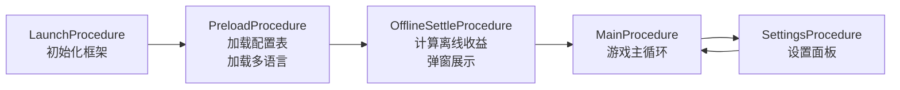

### 4.5 FSM 设计

#### 建筑 FSM（每个建筑实例一个）

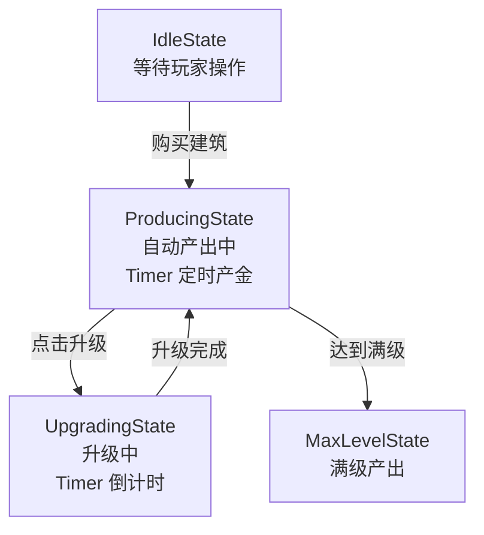

### 4.6 DataTable 结构

#### 建筑配置表 `building_config`

| 字段            | 类型   | 说明                     |
| --------------- | ------ | ------------------------ |
| id              | number | 建筑 ID                  |
| name            | string | 建筑名称（i18n key）     |
| baseCost        | number | 基础购买价格             |
| baseOutput      | number | 基础每秒产出             |
| outputInterval  | number | 产出间隔（秒）           |
| costMultiplier  | number | 升级费用倍率（指数底数） |
| outputPerLevel  | number | 每级增加产出             |
| maxLevel        | number | 最大等级                 |
| unlockCondition | number | 解锁所需总金币数         |

#### 升级曲线表 `upgrade_curve`

| 字段        | 类型   | 说明               |
| ----------- | ------ | ------------------ |
| id          | number | 行 ID              |
| buildingId  | number | 对应建筑 ID        |
| level       | number | 等级               |
| cost        | number | 升级费用           |
| output      | number | 该等级产出         |
| upgradeTime | number | 升级所需时间（秒） |

#### 成就配置表 `achievement_config`

| 字段   | 类型   | 说明                                                  |
| ------ | ------ | ----------------------------------------------------- |
| id     | number | 成就 ID                                               |
| name   | string | 成就名称（i18n key）                                  |
| desc   | string | 成就描述（i18n key）                                  |
| type   | string | 条件类型（totalGold / buildingLevel / buildingCount） |
| target | number | 达成目标值                                            |
| reward | number | 奖励金币                                              |

### 4.7 HTML 按钮与日志

**按钮组**：

- `[点击挖矿]` — 手动点击获取金币
- `[购买矿场]` `[购买伐木场]` `[购买农田]` `[购买炼金所]` — 购买建筑
- `[升级矿场]` `[升级伐木场]` ... — 升级已有建筑
- `[打开设置]` — 进入设置 Procedure
- `[模拟离线30分钟]` — 测试离线收益计算
- `[查看成就]` — 展示成就列表

**状态面板**：

- 当前金币 / 每秒总产出 / 各建筑等级和产出 / 活跃 Timer 数量

**日志示例**：

```
🟢 [LaunchProcedure] 框架初始化完成，注册 17 个模块
🔵 [PreloadProcedure] 加载 building_config (5行) ...完成
🟡 [OfflineSettle] 离线 1800 秒，收益 +54000 金币
🟢 [MainProcedure] 进入主游戏
🩵 [Timer] 矿场 Lv.3 产出 +15 金币 (interval: 2s)
🩵 [Timer] 伐木场 Lv.1 产出 +5 金币 (interval: 3s)
🔵 [Event] 金币变化: 1000 → 1015
🟢 [Achievement] 达成成就: 初露锋芒 (总金币超过1000)
🔶 [Upgrade] 矿场升级 Lv.3 → Lv.4, 费用 800 金币
```

### 4.8 集成测试要点

1. **Timer 精度测试**：多个不同间隔的 Timer 同时运行，验证产出准确性
2. **离线收益计算**：模拟 N 秒离线后，验证结算金额正确
3. **升级流程**：购买 → 升级 → 扣费 → 产出增加，完整流程验证
4. **成就触发**：达成条件后事件触发、UI 通知、奖励发放
5. **Procedure 切换**：Main ↔ Settings 双向切换，状态保持
6. **存档/读档**：模拟自动存档和读取

### 4.9 面试亮点

- **Timer 深度应用**：不同间隔 Timer 的管理、tag 分组暂停/恢复、离线收益用 timeScale 加速补帧
- **DataTable 配置驱动**：数值设计完全由配置表驱动，修改配置无需改代码
- **指数增长曲线**：面试常见的放置游戏数值设计讨论点

### 4.10 插件发现方向

- `fbi-save-system`：自动存档插件（序列化/反序列化 + localStorage / IndexedDB）
- `fbi-offline-reward`：离线收益计算引擎（支持多种结算策略）

---

## 5. Demo 2 — Turn-based RPG（回合制 RPG）

### 5.1 核心玩法

经典回合制 RPG 战斗系统。玩家组建队伍，进入关卡后与敌人回合制对战。

**编队 → 进入关卡 → 回合制战斗 → 结算 → 返回大厅**

### 5.2 玩法细节

- **角色系统**：3~4 个玩家角色，每个角色有 HP / MP / ATK / DEF / SPD 属性
- **技能系统**：每个角色 2~3 个技能（普攻、技能攻击、治疗/BUFF）
- **回合机制**：SPD 决定行动顺序，每回合角色依次选择行动
- **敌人 AI**：简单 AI——优先攻击 HP 最低的角色
- **关卡系统**：3 个关卡，难度递增，不同怪物组合
- **战斗结算**：经验值、金币掉落、角色升级

### 5.3 覆盖模块清单

| 模块                | 具体职责                                                                       |
| ------------------- | ------------------------------------------------------------------------------ |
| Core                | GameEntry 初始化                                                               |
| EventManager        | **深度使用** — 战斗事件流（攻击、受伤、死亡、回合切换、技能释放、BUFF变化）    |
| ObjectPool          | **深度使用** — 伤害飘字池、战斗特效池、BUFF 图标池                             |
| DI/IoC              | Container 注入策略                                                             |
| FSM                 | **深度使用** — 战斗 FSM（回合开始→选择行动→执行行动→回合结束→判定胜负）        |
| ProcedureManager    | **深度使用** — Launch → Preload → Lobby → BattlePrep → Battle → Settle → Lobby |
| ResourceManager     | 加载角色数据表、技能数据表、关卡配置表                                         |
| UIManager           | **深度使用** — 角色信息面板、技能选择面板、战斗日志面板、结算面板              |
| EntityManager       | **深度使用** — 角色实体和敌人实体管理（Group: "player" / "enemy"）             |
| AudioManager        | **深度使用** — 战斗 BGM、攻击音效、技能音效、胜利/失败音效                     |
| TimerManager        | BUFF 持续时间计时、技能冷却计时                                                |
| DataTableManager    | **深度使用** — 角色表、技能表、怪物表、关卡表                                  |
| SceneManager        | 大厅场景 ↔ 战斗场景切换                                                        |
| Logger              | 标准日志输出                                                                   |
| DebugManager        | 战斗数据实时展示（各角色 HP/MP、回合数、Entity 数量）                          |
| LocalizationManager | 技能名称、角色名称、战斗日志多语言                                             |
| NetworkManager      | 轻度使用 — 模拟在线排行榜                                                      |
| HotUpdateManager    | 轻度使用 — 模拟关卡配置更新                                                    |

### 5.4 Procedure 流程

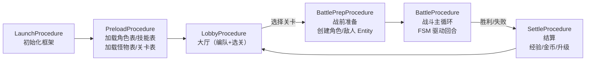

### 5.5 FSM 设计

#### 战斗 FSM（BattleFsm）

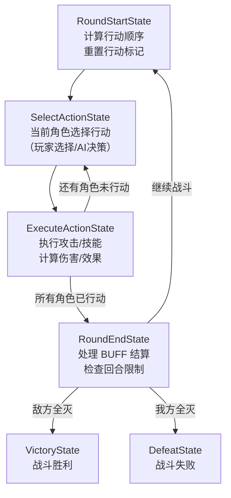

#### 角色状态 FSM（CharacterFsm）

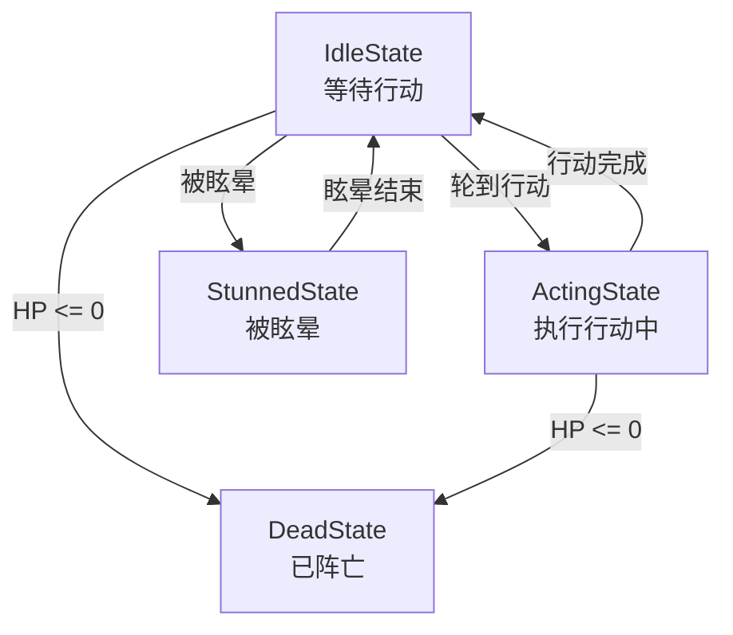

### 5.6 DataTable 结构

#### 角色配置表 `character_config`

| 字段   | 类型   | 说明                     |
| ------ | ------ | ------------------------ |
| id     | number | 角色 ID                  |
| name   | string | 名称 key                 |
| hp     | number | 基础 HP                  |
| mp     | number | 基础 MP                  |
| atk    | number | 攻击力                   |
| def    | number | 防御力                   |
| spd    | number | 速度                     |
| skills | string | 技能 ID 列表（逗号分隔） |

#### 技能配置表 `skill_config`

| 字段           | 类型   | 说明                                                          |
| -------------- | ------ | ------------------------------------------------------------- |
| id             | number | 技能 ID                                                       |
| name           | string | 技能名称 key                                                  |
| mpCost         | number | MP 消耗                                                       |
| damageRate     | number | 伤害倍率（基于 ATK）                                          |
| target         | string | 目标类型（single_enemy / all_enemy / single_ally / all_ally） |
| effect         | string | 附加效果（none / stun / heal / buff_atk）                     |
| effectDuration | number | 效果持续回合数                                                |
| cooldown       | number | 冷却回合数                                                    |

#### 怪物配置表 `monster_config`

| 字段       | 类型   | 说明     |
| ---------- | ------ | -------- |
| id         | number | 怪物 ID  |
| name       | string | 名称 key |
| hp         | number | HP       |
| atk        | number | 攻击力   |
| def        | number | 防御力   |
| spd        | number | 速度     |
| expReward  | number | 经验奖励 |
| goldReward | number | 金币奖励 |

#### 关卡配置表 `stage_config`

| 字段     | 类型   | 说明                     |
| -------- | ------ | ------------------------ |
| id       | number | 关卡 ID                  |
| name     | string | 关卡名称 key             |
| monsters | string | 怪物 ID 列表（逗号分隔） |
| bgm      | string | 背景音乐资源路径         |
| maxRound | number | 最大回合数（超过判败）   |

### 5.7 HTML 按钮与日志

**按钮组（大厅）**：

- `[角色1 信息]` `[角色2 信息]` `[角色3 信息]` — 查看角色属性
- `[关卡1: 新手村]` `[关卡2: 黑暗森林]` `[关卡3: 火山洞穴]` — 选择关卡
- `[出发!]` — 进入战斗

**按钮组（战斗中）**：

- `[普通攻击]` `[技能1]` `[技能2]` — 当前角色行动选择
- `[选择目标: 敌人1]` `[选择目标: 敌人2]` ... — 目标选择
- `[自动战斗]` — 切换 AI 自动

**日志示例**：

```
🔵 [Battle] === 第 3 回合 ===
🔵 [Battle] 行动顺序: 战士(SPD:12) → 敌人B(SPD:10) → 法师(SPD:8) → 敌人A(SPD:6)
🔶 [Battle] 战士 使用 [重击] → 敌人A, 伤害 45 (ATK:30 × 1.5 - DEF:10)
🔴 [Battle] 敌人A HP: 120 → 75
🟣 [Battle] 敌人B 使用 [普通攻击] → 法师, 伤害 18
🟢 [Battle] 牧师 使用 [治愈之光] → 法师, 恢复 HP 30
🟡 [Timer] BUFF [攻击强化] 剩余 2 回合
🔴 [Battle] 敌人A 被击败! 获得 50 经验, 20 金币
🟢 [Battle] ★ 战斗胜利! 总经验: 120, 总金币: 50
```

### 5.8 集成测试要点

1. **完整战斗流程**：从编队到战斗到结算的端到端测试
2. **回合顺序**：验证 SPD 排序正确性
3. **伤害计算**：ATK × damageRate - DEF，验证数值公式
4. **技能效果**：眩晕、治疗、BUFF 的正确应用和持续时间
5. **Entity 生命周期**：战前创建、战后回收
6. **FSM 状态切换**：战斗 FSM 各状态的正确转换
7. **死亡判定**：HP ≤ 0 触发死亡，全灭判定

### 5.9 面试亮点

- **FSM 实战**：战斗 FSM + 角色 FSM 双层状态机，解释为什么用 FSM 而非简单 if-else
- **Entity + ObjectPool 协作**：角色实体通过 EntityGroup 管理，BUFF 图标通过 ObjectPool 复用
- **事件驱动战斗**：攻击、受伤、死亡等事件解耦，方便扩展观察者（日志、音效、UI 更新）
- **DataTable 配置驱动**：完整的数值体系由配置表定义

### 5.10 插件发现方向

- `fbi-battle-engine`：通用回合制战斗引擎（可配置伤害公式、回合规则）
- `fbi-buff-system`：BUFF/DEBUFF 管理系统（堆叠、驱散、定时效果）

---

## 6. Demo 3 — Auto-chess Lite（自走棋）

### 6.1 核心玩法

简化版自走棋。玩家从商店购买棋子放到棋盘上，战斗阶段全自动进行。

**准备阶段（买棋/布阵）→ 战斗阶段（自动对战）→ 结算 → 下一回合**

### 6.2 玩法细节

- **棋盘**：4×4 文字网格，玩家方 2 行 + 敌方 2 行
- **商店**：每轮从棋子池随机抽取 3~5 个棋子出售
- **棋子合成**：3 个同名 ★1 棋子 → 1 个 ★2 棋子（属性翻倍）
- **羁绊/种族**：2~3 种羁绊效果（如"战士×3：全体 ATK+20%"）
- **自动战斗**：棋子按照简单 AI 自动寻找最近敌人攻击
- **PvE 对手**：每轮随机生成 AI 对手棋阵
- **生命值**：玩家 100 HP，输了回合扣 HP，HP ≤ 0 则游戏结束

### 6.3 覆盖模块清单

| 模块                | 具体职责                                                                     |
| ------------------- | ---------------------------------------------------------------------------- |
| Core                | GameEntry 初始化                                                             |
| EventManager        | **深度使用** — 棋子购买、放置、合成、战斗攻击、回合切换等事件                |
| ObjectPool          | **深度使用** — 棋子 Entity 回收复用（战斗结束后回池，下轮重新布阵）          |
| DI/IoC              | Container 注入策略                                                           |
| FSM                 | **深度使用** — 棋子 AI FSM（Idle→MoveTo→Attack→Idle）+ 游戏阶段 FSM          |
| ProcedureManager    | **深度使用** — Launch → Preload → PreparePhase → BattlePhase → Settle → 循环 |
| ResourceManager     | 加载棋子表、羁绊表                                                           |
| UIManager           | 商店面板、棋盘显示、玩家 HP 面板                                             |
| EntityManager       | **深度使用** — 大量棋子 Entity 管理（Group: "player_chess" / "enemy_chess"） |
| NetworkManager      | 模拟匹配对手数据                                                             |
| AudioManager        | 购买音效、合成音效、攻击音效、胜利/失败                                      |
| SceneManager        | 场景管理                                                                     |
| TimerManager        | **深度使用** — 准备阶段倒计时（30s）、战斗阶段每 tick AI 行动间隔            |
| DataTableManager    | **深度使用** — 棋子配置表、羁绊配置表、商店池配置                            |
| Logger              | 标准日志                                                                     |
| DebugManager        | 实时展示棋盘状态、Entity 数量、ObjectPool 统计                               |
| LocalizationManager | 棋子名称、羁绊描述                                                           |
| HotUpdateManager    | 轻度使用                                                                     |

### 6.4 Procedure 流程

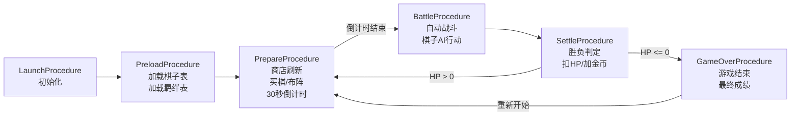

### 6.5 FSM 设计

#### 游戏阶段 FSM

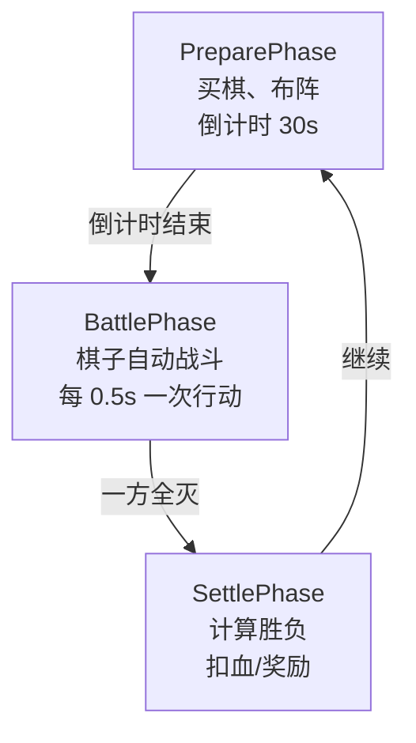

#### 棋子 AI FSM（每个棋子实例）

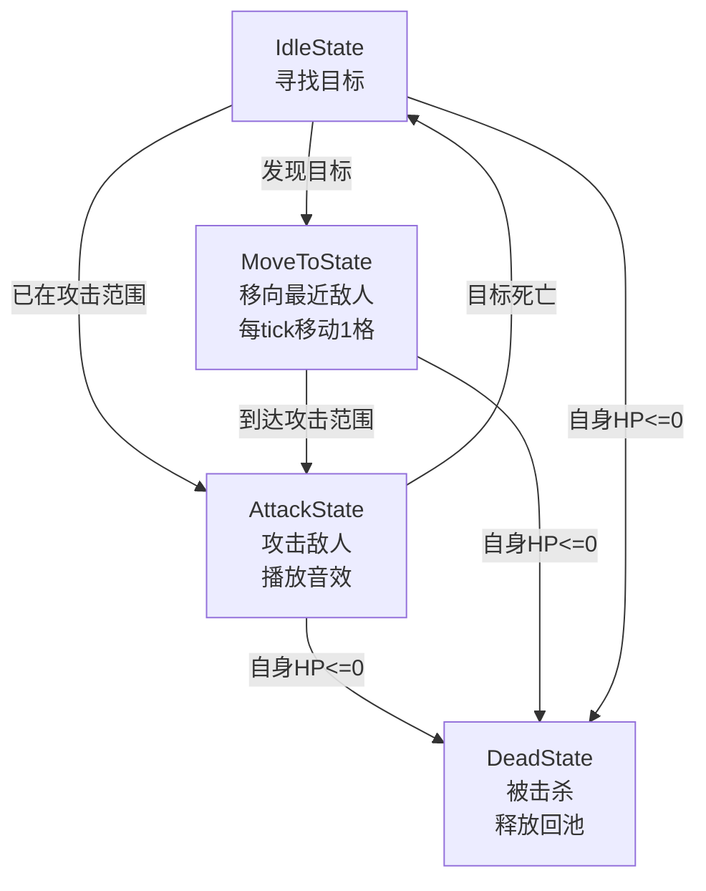

### 6.6 DataTable 结构

#### 棋子配置表 `chess_piece_config`

| 字段      | 类型   | 说明                                   |
| --------- | ------ | -------------------------------------- |
| id        | number | 棋子 ID                                |
| name      | string | 名称 key                               |
| race      | string | 种族（warrior / mage / ranger / tank） |
| hp        | number | 基础 HP                                |
| atk       | number | 攻击力                                 |
| atkSpeed  | number | 攻击间隔（秒）                         |
| range     | number | 攻击范围（格数）                       |
| cost      | number | 商店购买价格                           |
| star2Mult | number | ★2 属性倍率                            |

#### 羁绊配置表 `synergy_config`

| 字段      | 类型   | 说明                                         |
| --------- | ------ | -------------------------------------------- |
| id        | number | 羁绊 ID                                      |
| race      | string | 对应种族                                     |
| threshold | number | 激活所需数量                                 |
| effect    | string | 效果类型（atk_boost / hp_boost / spd_boost） |
| value     | number | 效果数值（百分比）                           |
| desc      | string | 描述 key                                     |

### 6.7 HTML 按钮与日志

**按钮组（准备阶段）**：

- `[刷新商店 (2金币)]` — 刷新商店棋子
- `[购买: 战士 (3金币)]` `[购买: 法师 (2金币)]` ... — 购买棋子
- `[放置棋子到 (1,1)]` `[(1,2)]` ... — 布阵
- `[锁定商店]` — 下轮保留当前商店
- `[准备完毕]` — 跳过倒计时

**按钮组（战斗阶段）**：

- `[加速 ×2]` `[加速 ×4]` — 加速战斗（timeScale）

**棋盘文字显示**：

```
=== 战斗棋盘 (Round 5) ===
  1    2    3    4
┌────┬────┬────┬────┐
│ E2 │    │ E1 │ E3 │ 4 (敌方)
├────┼────┼────┼────┤
│    │ E4 │    │    │ 3 (敌方)
├────┼────┼────┼────┤
│ P1 │    │ P3 │    │ 2 (己方)
├────┼────┼────┼────┤
│    │ P2 │    │ P4 │ 1 (己方)
└────┴────┴────┴────┘
P1=战士★2  P2=法师★1  P3=游侠★1  P4=坦克★1
羁绊激活: 战士×2 (未达标)  |  当前HP: 85/100
```

**日志示例**：

```
🔵 [Prepare] === 第 5 轮准备阶段 (30s) ===
🟢 [Shop] 商店刷新: 战士(3金), 法师(2金), 游侠(4金), 坦克(3金), 法师(2金)
🔵 [Buy] 购买法师 ★1, 花费 2 金币 (剩余: 8)
🟢 [Synergy] ★ 法师×2 → 合成 法师★2! ATK: 20 → 40, HP: 100 → 200
🟡 [Synergy] 羁绊检查: 战士×1 (需2), 法师×1 (需3)
🔶 [Battle] === 战斗开始 ===
🔶 [Battle] 战士★2 攻击 敌人法师, 伤害 35
🔶 [Battle] 敌人战士 攻击 P3游侠, 伤害 22
🔴 [Battle] P3 游侠★1 被击杀!
🟢 [Battle] 战斗胜利! 击杀 4 个敌人
🟡 [Settle] 回合奖励: +5 金币, 对手存活 0, 不扣HP
```

### 6.8 集成测试要点

1. **棋子合成**：购买 3 个同名棋子 → 自动合成 ★2，属性翻倍
2. **ObjectPool 复用**：战斗结束后棋子实体全部回收，下轮重新使用
3. **AI FSM 循环**：Idle→MoveTo→Attack 循环正确，目标死亡后重新寻找
4. **羁绊计算**：达到阈值后正确激活效果
5. **Entity 数量峰值**：同时管理 8~16 个棋子 Entity 无泄漏
6. **倒计时准确**：30s 倒计时到时自动切换战斗阶段

### 6.9 面试亮点

- **Entity + ObjectPool 深度协作**：大量实体的创建、回收、复用，讲解内存管理
- **FSM 驱动 AI**：每个棋子独立 FSM，解释为什么不用行为树（简单场景 FSM 更轻量）
- **Timer 多用途**：倒计时 + AI 行动节拍 + 战斗加速 timeScale
- **配置驱动设计**：棋子属性、合成规则、羁绊效果全部数据驱动

### 6.10 插件发现方向

- `fbi-grid-system`：通用网格系统（寻路、范围计算、碰撞检测）
- `fbi-ai-fsm`：AI 行为 FSM 扩展（带寻路和仇恨列表）

---

## 7. Demo 4 — Tactics Grid（战棋）

### 7.1 核心玩法

**战棋（SRPG 风格）**——玩家手动控制每个单位在网格地图上移动和攻击，类似 Fire Emblem / 梦幻模拟战。

**关键区分（战棋 vs 自走棋）**：

- 战棋：玩家手动控制每个单位的移动和攻击位置，强调战术决策
- 自走棋：玩家只管编队和布阵，战斗完全自动进行

**核心循环：选关 → 部署单位 → 回合制战斗（移动+攻击） → 关卡结算**

### 7.2 玩法细节

- **网格地图**：6×6 文字网格，支持不同地形
- **地形系统**：
    - 平原（Plain）：移动力消耗 1，防御加成 0%
    - 山地（Mountain）：移动力消耗 2，防御加成 +20%
    - 水域（Water）：步兵不可通过，弓手移动力消耗 3
    - 森林（Forest）：移动力消耗 1.5，防御加成 +10%，远程攻击减伤
- **单位类型**：
    - 战士（Warrior）：高 HP/DEF，移动力 3，攻击范围 1
    - 弓手（Archer）：高 ATK，移动力 4，攻击范围 2~3
    - 骑士（Knight）：高移动力 5，攻击范围 1，可穿越部分地形
    - 治疗师（Healer）：低攻击，治疗范围 2，移动力 3
- **回合机制**：
    - 玩家回合：依次操作己方所有单位（移动→攻击/技能→待机）
    - 敌方回合：AI 依次操作所有敌方单位
- **朝向系统**：背面受击伤害 ×1.5（侧面 ×1.2）
- **关卡目标**：击败所有敌人 / 保护 NPC / 指定回合内通关

### 7.3 覆盖模块清单

| 模块                | 具体职责                                                                        |
| ------------------- | ------------------------------------------------------------------------------- |
| Core                | GameEntry 初始化                                                                |
| EventManager        | **深度使用** — 单位移动、攻击、受伤、死亡、回合切换、地形触发、关卡目标事件     |
| ObjectPool          | **深度使用** — 伤害飘字池、移动路径标记池、攻击范围指示池                       |
| DI/IoC              | Container 注入策略                                                              |
| FSM                 | **深度使用** — 回合 FSM + 单位行动 FSM（双层嵌套）                              |
| ProcedureManager    | **深度使用** — Launch → Preload → StageSelect → Deploy → TacticsBattle → Settle |
| ResourceManager     | 加载地图表、单位表、技能表                                                      |
| UIManager           | 单位信息面板、地形信息面板、行动选择面板                                        |
| EntityManager       | **深度使用** — 玩家单位 + 敌方单位 + NPC 三组 Entity 管理                       |
| AudioManager        | 移动音效、攻击音效、技能音效、BGM                                               |
| SceneManager        | 场景管理                                                                        |
| TimerManager        | AI 思考延迟（模拟 AI 决策时间），回合时间限制                                   |
| DataTableManager    | **深度使用** — 单位表、地形表、技能表、关卡地图表                               |
| Logger              | 标准日志                                                                        |
| DebugManager        | 实时展示地图状态、Entity 数量、FSM 状态                                         |
| LocalizationManager | 单位名称、地形描述、技能名称                                                    |
| NetworkManager      | 轻度使用                                                                        |
| HotUpdateManager    | 轻度使用                                                                        |

### 7.4 Procedure 流程

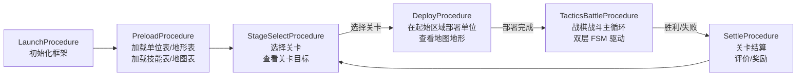

### 7.5 FSM 设计

#### 回合 FSM（TurnFsm）— 外层

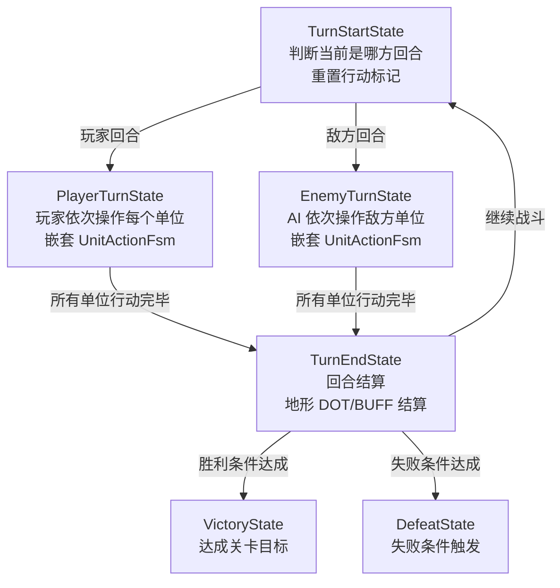

#### 单位行动 FSM（UnitActionFsm）— 内层（每个单位行动时创建）

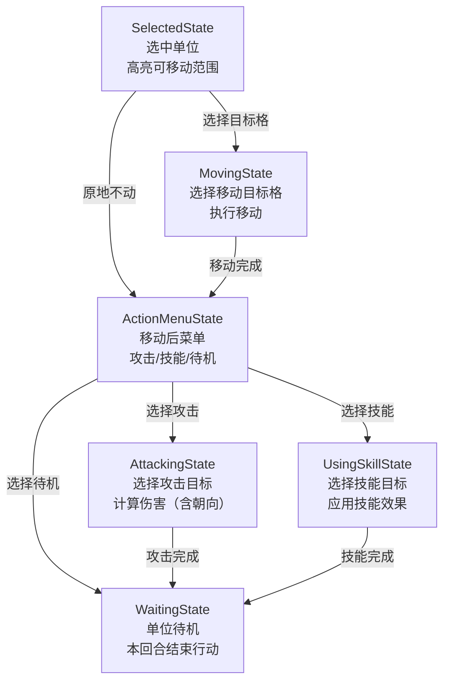

**双层嵌套说明**：

- **外层 TurnFsm**：控制回合大循环（玩家回合 ↔ 敌方回合）
- **内层 UnitActionFsm**：控制单个单位的行动流程（选中→移动→行动→待机）
- 玩家回合期间，每操作一个单位就创建/复用一个 UnitActionFsm
- 敌方回合期间，AI 通过 UnitActionFsm 执行自动决策

### 7.6 DataTable 结构

#### 单位配置表 `tactics_unit_config`

| 字段      | 类型   | 说明                                 |
| --------- | ------ | ------------------------------------ |
| id        | number | 单位 ID                              |
| name      | string | 名称 key                             |
| unitClass | string | 职业（warrior/archer/knight/healer） |
| hp        | number | 基础 HP                              |
| atk       | number | 攻击力                               |
| def       | number | 防御力                               |
| moveRange | number | 移动力（格数）                       |
| atkRange  | string | 攻击范围（如 "1" 或 "2-3"）          |
| skills    | string | 技能 ID 列表                         |
| passable  | string | 可通过的特殊地形（如 "water"）       |

#### 地形配置表 `terrain_config`

| 字段       | 类型   | 说明                                    |
| ---------- | ------ | --------------------------------------- |
| id         | number | 地形 ID                                 |
| type       | string | 地形类型（plain/mountain/water/forest） |
| moveCost   | number | 移动力消耗                              |
| defBonus   | number | 防御加成百分比                          |
| atkPenalty | number | 远程攻击减伤百分比（森林遮蔽）          |
| passable   | string | 允许通过的职业（all/mounted/none）      |
| desc       | string | 描述 key                                |

#### 技能配置表 `tactics_skill_config`

| 字段      | 类型   | 说明                     |
| --------- | ------ | ------------------------ |
| id        | number | 技能 ID                  |
| name      | string | 技能名称 key             |
| type      | string | 类型（attack/heal/buff） |
| range     | number | 作用范围（格数）         |
| power     | number | 威力/治疗量              |
| cooldown  | number | 冷却回合数               |
| aoeRadius | number | AOE 半径（0=单体）       |
| desc      | string | 描述 key                 |

#### 关卡地图配置表 `tactics_map_config`

| 字段         | 类型   | 说明                                             |
| ------------ | ------ | ------------------------------------------------ |
| id           | number | 关卡 ID                                          |
| name         | string | 关卡名称 key                                     |
| width        | number | 地图宽度                                         |
| height       | number | 地图高度                                         |
| terrain      | string | 地形矩阵（如 "PPMPFF/PPWWPP/..."）               |
| playerSpawns | string | 玩家出生点（如 "0,0;1,0;0,1"）                   |
| enemyUnits   | string | 敌方单位配置（如 "1,3,3;2,4,4"）                 |
| winCondition | string | 胜利条件（defeat_all/protect_npc/survive_turns） |
| winParam     | number | 胜利参数（NPC id / 回合数）                      |
| maxTurns     | number | 最大回合数                                       |

### 7.7 HTML 按钮与日志

**按钮组（关卡选择）**：

- `[关卡1: 平原遭遇]` `[关卡2: 山地伏击]` `[关卡3: 河谷之战]` — 选择关卡

**按钮组（部署阶段）**：

- `[部署战士到(0,0)]` `[部署弓手到(1,0)]` ... — 放置单位
- `[查看地形]` — 显示地形详情
- `[开始战斗!]`

**按钮组（玩家回合）**：

- `[选择: 战士]` `[选择: 弓手]` `[选择: 骑士]` `[选择: 治疗师]` — 选择操作单位
- `[移动到(x,y)]` — 移动目标
- `[攻击]` `[技能1]` `[待机]` — 行动选择
- `[选择目标: 敌人A]` — 攻击目标
- `[结束回合]` — 提前结束玩家回合

**地图文字显示**：

```
=== 关卡2: 山地伏击 (Turn 3 - 玩家回合) ===
    1     2     3     4     5     6
  ┌─────┬─────┬─────┬─────┬─────┬─────┐
6 │  P  │  F  │  F  │  M  │  M  │  P  │
  ├─────┼─────┼─────┼─────┼─────┼─────┤
5 │  P  │  P  │ [W] │  M  │ E:弓│  P  │
  ├─────┼─────┼─────┼─────┼─────┼─────┤
4 │  F  │ ★戦 │  P  │  W  │  W  │ E:戦│
  ├─────┼─────┼─────┼─────┼─────┼─────┤
3 │  P  │  P  │ P:弓│  P  │  F  │  P  │
  ├─────┼─────┼─────┼─────┼─────┼─────┤
2 │  M  │  P  │  P  │ P:騎│  P  │  P  │
  ├─────┼─────┼─────┼─────┼─────┼─────┤
1 │  M  │  M  │  P  │  P  │ P:治│  P  │
  └─────┴─────┴─────┴─────┴─────┴─────┘
地形: P=平原 M=山地 W=水域 F=森林
★ = 当前选中单位  [W] = 可移动范围
P:戦=玩家战士(HP:80/100)  E:弓=敌方弓手(HP:45/60)
```

**日志示例**：

```
🔵 [Tactics] === Turn 3 - 玩家回合 ===
🔵 [Tactics] 选中: 战士 (4,2) HP:80/100 移动力:3
🟢 [Tactics] 移动范围计算: 可达 6 个格子（含地形消耗）
🔵 [Move] 战士 从 (4,2) 移动到 (4,4) [森林] DEF+10%
🔶 [Attack] 战士 攻击 敌方弓手(5,5), ATK:25 vs DEF:8
🔶 [Attack] 朝向加成: 侧面攻击 ×1.2
🔶 [Attack] 地形减伤: 弓手在山地 DEF+20%
🔴 [Damage] 敌方弓手 受到 23 点伤害, HP: 45 → 22
🟡 [Wait] 战士 待机, 朝向: →
🔵 [Tactics] === Turn 3 - 敌方回合 ===
🟣 [AI] 敌方战士 决策: 移向最近玩家单位(弓手)
🔶 [Attack] 敌方战士 攻击 P:弓手, 背面攻击 ×1.5!
🔴 [Damage] P:弓手 受到 36 点伤害! HP: 50 → 14 ⚠️ 危险!
🟢 [Heal] 治疗师 使用 [治愈术] → 弓手, 恢复 25 HP
```

### 7.8 集成测试要点

1. **移动范围计算**：验证不同地形消耗移动力后的可达范围
2. **地形效果**：山地防御加成、水域不可通过、森林远程减伤
3. **朝向伤害**：正面/侧面/背面不同的伤害倍率
4. **双层 FSM 嵌套**：TurnFsm 正确驱动 UnitActionFsm，状态不错乱
5. **AI 决策**：敌方 AI 正确寻路到最近目标、优先攻击低 HP 单位
6. **胜利/失败条件**：全灭判定、NPC 保护判定、回合限制
7. **Entity 三组管理**：player / enemy / npc 三个 EntityGroup 独立管理
8. **技能冷却**：使用技能后冷却回合数正确倒计

### 7.9 面试亮点

- **FSM 多层嵌套**：外层回合 FSM + 内层单位行动 FSM，是面试中 FSM 深度应用的绝佳案例
- **网格寻路与范围计算**：BFS 计算可达范围（考虑地形消耗），经典算法面试题
- **地形系统**：DataTable 驱动的地形效果，展示配置与代码分离
- **Entity 三组管理**：player / enemy / npc，展示 EntityGroup 的实际业务价值
- **战术 AI**：简单但完整的 AI 决策树（寻路 + 目标选择 + 攻击），可深入讨论优化

### 7.10 插件发现方向

- `fbi-grid-system`：通用网格系统（A\* 寻路、BFS 范围计算、六角网格支持）
- `fbi-tactics-ai`：战棋 AI 引擎（威胁评估、多目标优先级、阵型分析）
- `fbi-turn-system`：通用回合管理器（支持插入行动、延迟行动、行动取消）

---

## 8. Demo 5 — Multiplayer Arena（多人对战）

### 8.1 核心玩法

多人对战竞技场——2 个玩家（1 真人 + 1 AI Mock）在竞技场中实时对战。通过 MockNetworkSocket 模拟网络通信。

**匹配 → 加载 → 倒计时 → 实时对战 → 结算**

### 8.2 玩法细节

- **竞技场**：5×5 文字网格，两名玩家各控制 1 个角色
- **实时移动**：每 0.5 秒可移动一次（模拟实时但分 tick）
- **技能系统**：每个角色 3 个技能（近战攻击、远程投射、闪避翻滚）
- **状态同步**：通过 MockNetworkSocket 模拟客户端 → 服务端 → 客户端的消息流
- **延迟模拟**：50~200ms 随机延迟，体验网络抖动
- **断线重连**：模拟网络断线后重新连接，状态恢复
- **观战模式**：模拟第三人观战（只接收状态同步，不发送操作）

### 8.3 覆盖模块清单

| 模块                | 具体职责                                                                           |
| ------------------- | ---------------------------------------------------------------------------------- |
| Core                | GameEntry 初始化                                                                   |
| EventManager        | **深度使用** — 网络消息事件、状态同步事件、连接状态事件、战斗事件                  |
| ObjectPool          | **深度使用** — NetworkPacket 对象池（高频消息复用）                                |
| DI/IoC              | Container 注入策略                                                                 |
| FSM                 | **深度使用** — 角色状态 FSM（Idle→Moving→Attacking→Rolling→Stunned）               |
| ProcedureManager    | **深度使用** — Launch → Preload → Matching → Loading → Countdown → Battle → Settle |
| ResourceManager     | 加载角色配置                                                                       |
| UIManager           | 匹配面板、战斗 HUD（双方 HP）、断线提示面板                                        |
| EntityManager       | **深度使用** — 玩家角色 Entity + 投射物 Entity                                     |
| NetworkManager      | **深度使用** — MockNetworkSocket 双通道（游戏通道 + 匹配通道）、心跳、重连         |
| AudioManager        | 攻击音效、技能音效、匹配成功音效                                                   |
| SceneManager        | 大厅场景 ↔ 竞技场场景                                                              |
| TimerManager        | **深度使用** — 移动 tick 间隔、技能冷却、倒计时、对局时长限制                      |
| DataTableManager    | 角色属性表、技能表                                                                 |
| Logger              | 标准日志                                                                           |
| DebugManager        | 网络延迟监控、丢包率、消息频率、Entity 状态                                        |
| LocalizationManager | 角色名称、技能名称                                                                 |
| HotUpdateManager    | 轻度使用                                                                           |

### 8.4 Procedure 流程

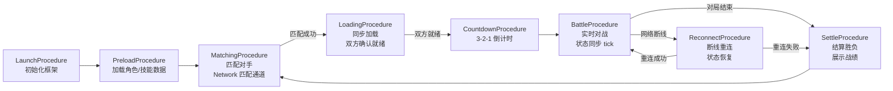

### 8.5 FSM 设计

#### 角色战斗 FSM（PlayerBattleFsm）

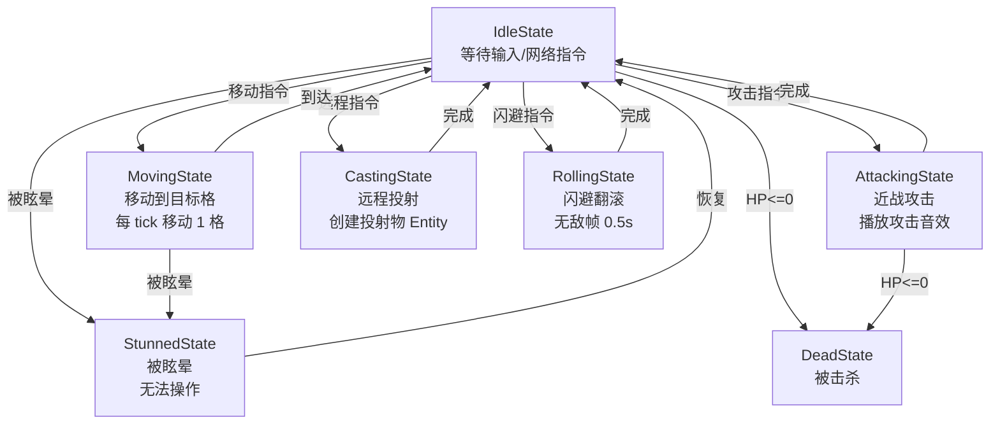

#### 网络状态 FSM（ConnectionFsm）

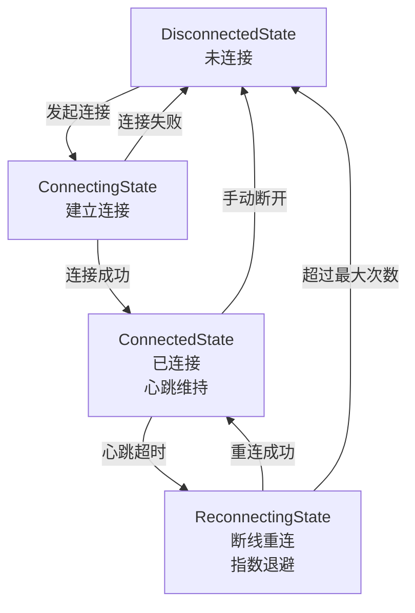

### 8.6 网络协议设计

#### 消息 ID 定义

| ID   | 消息名              | 方向            | 描述                           |
| ---- | ------------------- | --------------- | ------------------------------ |
| 1001 | C2S_MATCH_REQUEST   | Client → Server | 请求匹配                       |
| 1002 | S2C_MATCH_RESULT    | Server → Client | 匹配结果（对手信息）           |
| 2001 | C2S_PLAYER_INPUT    | Client → Server | 玩家操作（移动/攻击/技能）     |
| 2002 | S2C_STATE_SYNC      | Server → Client | 状态同步帧（双方位置/HP/状态） |
| 2003 | S2C_BATTLE_EVENT    | Server → Client | 战斗事件（伤害/击杀/效果）     |
| 2004 | C2S_HEARTBEAT       | Client → Server | 心跳包                         |
| 2005 | S2C_HEARTBEAT_ACK   | Server → Client | 心跳回复                       |
| 3001 | S2C_GAME_START      | Server → Client | 游戏开始（倒计时结束）         |
| 3002 | S2C_GAME_OVER       | Server → Client | 游戏结束（胜负结果）           |
| 3003 | C2S_RECONNECT       | Client → Server | 断线重连请求                   |
| 3004 | S2C_RECONNECT_STATE | Server → Client | 重连后的完整状态快照           |

#### MockNetworkSocket 实现要点

```typescript
// MockNetworkSocket 内部维护一个"虚拟服务器"
class MockNetworkSocket implements INetworkSocket {
    // 模拟延迟（50~200ms）
    private _latencyRange: [number, number] = [50, 200];

    // 模拟丢包率
    private _packetLossRate: number = 0;

    // 虚拟服务器的游戏状态
    private _serverState: ArenaServerState;

    // 收到 C2S_PLAYER_INPUT 后：
    // 1. 添加随机延迟
    // 2. 更新服务器状态
    // 3. 广播 S2C_STATE_SYNC 给所有客户端
}
```

### 8.7 HTML 按钮与日志

**按钮组（大厅）**：

- `[开始匹配]` `[取消匹配]` — 匹配操作
- `[查看战绩]` — 历史战绩

**按钮组（战斗中）**：

- `[↑]` `[←]` `[→]` `[↓]` — 移动方向
- `[近战攻击 (CD: 0)]` — 近战
- `[远程投射 (CD: 3)]` — 远程技能
- `[闪避翻滚 (CD: 5)]` — 闪避

**按钮组（调试）**：

- `[模拟断线]` `[模拟高延迟 (500ms)]` `[模拟丢包 30%]` — 网络调试
- `[切换观战模式]` — 观战

**竞技场文字显示**：

```
=== 竞技场 (Tick 42 | 延迟: 87ms) ===
    1     2     3     4     5
  ┌─────┬─────┬─────┬─────┬─────┐
5 │     │     │     │     │     │
  ├─────┼─────┼─────┼─────┼─────┤
4 │     │  ⚔  │     │     │     │
  ├─────┼─────┼─────┼─────┼─────┤
3 │     │ [P1]│     │ [P2]│     │
  ├─────┼─────┼─────┼─────┼─────┤
2 │     │     │  💫 │     │     │
  ├─────┼─────┼─────┼─────┼─────┤
1 │     │     │     │     │     │
  └─────┴─────┴─────┴─────┴─────┘
P1: 玩家 HP:75/100 [Idle]   P2: AI HP:60/100 [Moving→(3,4)]
⚔=攻击特效  💫=投射物
```

**日志示例**：

```
🟣 [Network] 发送 C2S_MATCH_REQUEST
🟣 [Network] 收到 S2C_MATCH_RESULT: 对手=AI_Player (延迟: 92ms)
🟢 [Match] 匹配成功! 3-2-1 倒计时...
🟣 [Network] 状态同步 tick#1: P1(2,3) P2(4,3)
🔵 [Input] 玩家操作: 移动→(2,4)
🟣 [Network] 发送 C2S_PLAYER_INPUT {type:'move', dir:'up'}
🟣 [Network] 收到 S2C_STATE_SYNC tick#2: P1(2,4) P2(3,3) (延迟: 67ms)
🔶 [Battle] 玩家 近战攻击 → AI_Player, 伤害 25
🔴 [Network] ⚠️ 连接中断! 尝试重连 (1/5)
🟡 [Network] 重连延迟: 1000ms (指数退避)
🟢 [Network] 重连成功! 恢复状态快照 tick#58
🟢 [Battle] ★ 战斗胜利! 击杀对手
```

### 8.8 集成测试要点

1. **匹配流程**：C2S_MATCH_REQUEST → S2C_MATCH_RESULT 完整消息流
2. **状态同步**：每 tick 同步位置/HP/状态，验证一致性
3. **延迟处理**：50~200ms 延迟下操作响应正常
4. **断线重连**：模拟断线 → 自动重连 → 状态恢复
5. **丢包容错**：30% 丢包率下游戏仍可正常运行
6. **心跳机制**：心跳超时触发断线检测
7. **ObjectPool 消息复用**：高频 NetworkPacket 对象的池化复用
8. **双通道管理**：匹配通道和游戏通道独立运作

### 8.9 面试亮点

- **NetworkManager 深度实战**：从协议设计到消息处理到断线重连，完整网络层
- **状态同步 vs 帧同步**：可深入讨论两种网络架构（Demo 采用状态同步）
- **指数退避重连**：baseDelay × 2^(n-1)，避免雷鸣群效应
- **MockNetworkSocket 设计**：如何设计一个真实度足够高的网络 Mock（延迟、丢包、断线）
- **ObjectPool 高频场景**：网络包对象的池化复用，减少 GC 压力

### 8.10 插件发现方向

- `fbi-state-sync`：通用状态同步引擎（差量同步、快照对比、插值预测）
- `fbi-matchmaking`：匹配系统（ELO 积分、房间管理、负载均衡）
- `fbi-replay`：回放系统（录制操作序列 + 回放引擎）

---

## 9. Demo 6 — Game Launcher（游戏启动器）

### 9.1 核心玩法

不是"游戏"，而是一个**游戏启动器**——展示框架的 HotUpdate、Scene 切换、i18n 切换和 DebugPanel 全面能力。玩家选择一个 Demo 启动，启动前自动检查更新。

### 9.2 功能细节

- **启动器主界面**：列出 Demo 1~5，显示每个游戏的名称、描述、版本号
- **热更新流程**：启动 Demo 前执行完整 HotUpdate 流程（版本检查→下载→校验→应用）
- **多语言切换**：启动器支持中文/英文/日文切换，所有 UI 文本动态更新
- **Scene 管理**：启动器是一个 Scene，每个 Demo 是独立 Scene，支持切换和返回
- **DebugPanel 展示**：实时展示所有模块状态、事件统计、内存使用
- **设置系统**：音量设置、语言设置、开发者模式开关
- **新闻公告**：模拟从服务端拉取公告信息（Network）

### 9.3 覆盖模块清单

| 模块                | 具体职责                                                                          |
| ------------------- | --------------------------------------------------------------------------------- |
| Core                | GameEntry 初始化，模块注册                                                        |
| EventManager        | 语言切换事件、热更新事件、场景切换事件、设置变更事件                              |
| ObjectPool          | 轻度使用                                                                          |
| DI/IoC              | Container 注入策略                                                                |
| FSM                 | 轻度使用                                                                          |
| ProcedureManager    | **深度使用** — Launch → HotUpdate → Menu → DemoLoading → DemoRunning → BackToMenu |
| ResourceManager     | 加载 Demo 配置、公告数据、多语言资源                                              |
| UIManager           | **深度使用** — 主菜单面板、设置面板、更新进度面板、公告面板、Demo 信息面板        |
| EntityManager       | 轻度使用                                                                          |
| NetworkManager      | 模拟公告拉取、版本检查（HTTP 模拟）                                               |
| AudioManager        | 背景音乐、按钮点击音效                                                            |
| SceneManager        | **深度使用** — Launcher Scene ↔ Demo Scene 互相切换                               |
| TimerManager        | 轻度使用 — 公告轮播 Timer                                                         |
| DataTableManager    | Demo 列表配置表                                                                   |
| LocalizationManager | **深度使用** — 全界面多语言（中/英/日），动态切换所有文本                         |
| Logger              | 标准日志                                                                          |
| DebugManager        | **深度使用** — 展示 DebugPanel 完整功能，所有 DataSource 注册                     |
| HotUpdateManager    | **深度使用** — 完整热更新流程（版本检查→清单对比→差量下载→MD5校验→应用→回退）     |

### 9.4 Procedure 流程

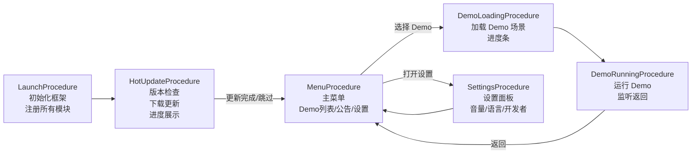

### 9.5 HotUpdate 流程（详细）

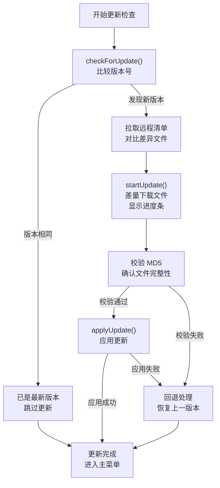

### 9.6 DataTable 结构

#### Demo 列表配置表 `demo_list`

| 字段      | 类型   | 说明             |
| --------- | ------ | ---------------- |
| id        | number | Demo ID          |
| name      | string | 名称 key（i18n） |
| desc      | string | 描述 key（i18n） |
| version   | string | 当前版本号       |
| sceneName | string | 场景名称         |
| icon      | string | 图标资源路径     |
| tags      | string | 标签（逗号分隔） |

### 9.7 i18n 多语言文本

```json
{
    "launcher.title": {
        "zh-CN": "游戏启动器",
        "en-US": "Game Launcher",
        "ja-JP": "ゲームランチャー"
    },
    "launcher.demo1.name": { "zh-CN": "挂机放置", "en-US": "Idle Clicker", "ja-JP": "放置ゲーム" },
    "launcher.demo2.name": {
        "zh-CN": "回合制RPG",
        "en-US": "Turn-based RPG",
        "ja-JP": "ターン制RPG"
    },
    "launcher.demo3.name": { "zh-CN": "自走棋", "en-US": "Auto-chess", "ja-JP": "オートチェス" },
    "launcher.demo4.name": { "zh-CN": "战棋", "en-US": "Tactics Grid", "ja-JP": "タクティクス" },
    "launcher.demo5.name": {
        "zh-CN": "多人对战",
        "en-US": "Multiplayer Arena",
        "ja-JP": "マルチプレイ"
    },
    "launcher.settings": { "zh-CN": "设置", "en-US": "Settings", "ja-JP": "設定" },
    "launcher.language": { "zh-CN": "语言", "en-US": "Language", "ja-JP": "言語" },
    "launcher.update.checking": {
        "zh-CN": "正在检查更新...",
        "en-US": "Checking for updates...",
        "ja-JP": "アップデートを確認中..."
    },
    "launcher.update.downloading": {
        "zh-CN": "下载中 {0}%",
        "en-US": "Downloading {0}%",
        "ja-JP": "ダウンロード中 {0}%"
    },
    "launcher.update.complete": {
        "zh-CN": "更新完成",
        "en-US": "Update complete",
        "ja-JP": "アップデート完了"
    }
}
```

### 9.8 HTML 按钮与日志

**按钮组（主菜单）**：

- `[🎮 挂机放置 v1.0.0]` `[⚔️ 回合制RPG v1.0.0]` `[♟ 自走棋 v1.0.0]` `[🏰 战棋 v1.0.0]` `[🏟 多人对战 v1.0.0]` — 选择 Demo
- `[⚙️ 设置]` — 打开设置
- `[📢 公告]` — 查看公告
- `[🔍 检查更新]` — 手动检查更新
- `[🐛 DebugPanel]` — 切换调试面板

**按钮组（设置面板）**：

- `[🌐 中文]` `[🌐 English]` `[🌐 日本語]` — 语言切换
- `[🔊 主音量: 80%]` `[🎵 音乐: 60%]` `[🔉 音效: 100%]` — 音量调节
- `[🛠 开发者模式: 关]` — 开发者模式

**按钮组（DebugPanel）**：

- `[📊 模块状态]` — ModuleDataSource 采集结果
- `[📡 事件统计]` — EventDataSource 采集结果
- `[🔧 收集快照]` — 手动触发 collectAll()

**日志示例**：

```
🟢 [Launch] 框架初始化完成, 17 个模块注册成功
🔵 [HotUpdate] 检查更新... 本地版本: 1.0.0
🟣 [Network] 版本检查请求发送 (延迟: 120ms)
🟢 [HotUpdate] 发现新版本 1.1.0!
🔵 [HotUpdate] 开始下载更新... 3个文件需要更新
🩵 [HotUpdate] 下载进度: 33% → 66% → 100%
🟢 [HotUpdate] MD5 校验通过, 应用更新...
🟢 [HotUpdate] 更新完成! 1.0.0 → 1.1.0
🔵 [i18n] 语言切换: zh-CN → en-US
🔵 [i18n] 界面文本刷新: 12 个文本已更新
🔵 [Scene] 加载场景: IdleClicker (进度: 0% → 50% → 100%)
🟢 [Scene] 场景切换完成: Launcher → IdleClicker
🔵 [Debug] DebugPanel 快照:
  ├─ 模块数: 17 (17 已初始化)
  ├─ 事件监听器: 42 个
  ├─ ObjectPool: 3 个池, 总对象 128
  └─ Timer: 8 个活跃
```

### 9.9 集成测试要点

1. **HotUpdate 完整流程**：版本检查 → 清单对比 → 差量下载 → MD5 校验 → 应用更新
2. **HotUpdate 失败回退**：下载失败/校验失败后正确回退
3. **i18n 动态切换**：切换语言后所有文本正确更新
4. **Scene 切换**：Launcher → Demo → Launcher 来回切换无状态泄漏
5. **DebugPanel 数据采集**：所有 DataSource 正确注册和采集
6. **Procedure 完整流程**：从 Launch 到 Menu 到各 Demo 的流程跳转
7. **音量设置持久化**：设置 → 离开 → 返回，设置值保持

### 9.10 面试亮点

- **HotUpdate 完整方案**：两阶段检查（轻量版本号 + 完整清单）、差量下载、MD5 校验、回退机制
- **i18n 实战**：运行时动态切换语言，事件驱动 UI 刷新
- **DebugManager 价值**：演示 DataSource 插件化采集的实际效果
- **Scene 管理**：多 Scene 切换、加载进度、资源释放

### 9.11 插件发现方向

- `fbi-settings`：设置管理器（持久化 + 类型安全 + 热加载）
- `fbi-announcement`：公告系统（服务端拉取 + 缓存 + 轮播）
- `fbi-launcher`：通用启动器 SDK（版本管理 + 场景路由 + 设置中心）

---

## 10. 开发顺序建议

### 推荐顺序

| 阶段 | Demo                  | 理由                                                           |
| ---- | --------------------- | -------------------------------------------------------------- |
| 1    | Demo 0 Infrastructure | 必须首先完成——所有其他 Demo 依赖此基础设施                     |
| 2    | Demo 1 Idle Clicker   | 最简单的游戏循环，验证 DemoBase + Timer + DataTable 的基础协作 |
| 3    | Demo 2 Turn-based RPG | 中等复杂度，验证 FSM + Entity + 完整战斗系统                   |
| 4    | Demo 4 Tactics Grid   | 在 Demo 2 基础上进阶——双层 FSM + 网格系统 + 地形               |
| 5    | Demo 3 Auto-chess     | 与 Demo 4 类似但侧重不同（AI FSM + ObjectPool 大量复用）       |
| 6    | Demo 5 Arena          | Network 深度使用，需要 Mock 设计经验充足后再做                 |
| 7    | Demo 6 Launcher       | 最后做——集成所有 Demo，测试 HotUpdate + Scene 切换 + i18n      |

### 顺序理由

1. **Demo 0 → Demo 1**：先建基础，再用最简单的游戏验证
2. **Demo 2 → Demo 4**：RPG 的战斗 FSM 是战棋双层 FSM 的基础
3. **Demo 4 在 Demo 3 之前**：战棋的手动操作比自走棋更容易调试和验证
4. **Demo 5 靠后**：网络 Mock 比较复杂，需要前面 Demo 的开发经验
5. **Demo 6 最后**：作为大整合，需要所有 Demo 开发经验

---

## 11. 插件发现汇总

通过 Demo Series 发现的可提取插件方向：

| 插件名               | 来源 Demo | 描述                                             | 优先级 |
| -------------------- | --------- | ------------------------------------------------ | ------ |
| `fbi-save-system`    | Demo 1    | 自动存档（序列化 + localStorage/IndexedDB）      | 高     |
| `fbi-offline-reward` | Demo 1    | 离线收益计算引擎                                 | 中     |
| `fbi-battle-engine`  | Demo 2    | 通用回合制战斗引擎（可配置伤害公式、回合规则）   | 高     |
| `fbi-buff-system`    | Demo 2    | BUFF/DEBUFF 管理（堆叠、驱散、定时效果）         | 高     |
| `fbi-grid-system`    | Demo 3/4  | 通用网格系统（A\* 寻路、BFS 范围、六角支持）     | 高     |
| `fbi-ai-fsm`         | Demo 3    | AI 行为 FSM（寻路 + 仇恨列表）                   | 中     |
| `fbi-tactics-ai`     | Demo 4    | 战棋 AI（威胁评估、多目标优先级、阵型分析）      | 中     |
| `fbi-turn-system`    | Demo 4    | 通用回合管理器（插入行动、延迟行动、行动取消）   | 中     |
| `fbi-state-sync`     | Demo 5    | 通用状态同步引擎（差量同步、快照对比、插值预测） | 高     |
| `fbi-matchmaking`    | Demo 5    | 匹配系统（ELO 积分、房间管理）                   | 低     |
| `fbi-replay`         | Demo 5    | 回放系统（录制操作 + 回放引擎）                  | 低     |
| `fbi-settings`       | Demo 6    | 设置管理器（持久化 + 类型安全 + 热加载）         | 中     |
| `fbi-announcement`   | Demo 6    | 公告系统（拉取 + 缓存 + 轮播）                   | 低     |

---

## 附录 A：策略注入接口一览

| 模块             | 策略接口             | Mock 实现               |
| ---------------- | -------------------- | ----------------------- |
| ResourceManager  | `IResourceLoader`    | `MockResourceLoader`    |
| AudioManager     | `IAudioPlayer`       | `MockAudioPlayer`       |
| SceneManager     | `ISceneLoader`       | `MockSceneLoader`       |
| UIManager        | `IUIFormFactory`     | `MockUIFormFactory`     |
| EntityManager    | `IEntityFactory`     | `MockEntityFactory`     |
| NetworkManager   | `INetworkSocket`     | `MockNetworkSocket`     |
| DataTableManager | `IDataTableParser`   | `MockDataTableParser`   |
| HotUpdateManager | `IHotUpdateAdapter`  | `MockHotUpdateAdapter`  |
| HotUpdateManager | `IVersionComparator` | `MockVersionComparator` |

## 附录 B：集成测试共用 Utilities

```typescript
// 所有 Demo 集成测试共用
class TestDemoHelper {
    /** 快速初始化一个带全部 Mock 的 GameEntry */
    static createMockGameEntry(): GameEntry;

    /** 模拟 N 帧 update（deltaTime 默认 1/60） */
    static simulateFrames(entry: GameEntry, frameCount: number, deltaTime?: number): void;

    /** 模拟 N 秒时间流逝 */
    static simulateTime(entry: GameEntry, seconds: number, fps?: number): void;

    /** 等待 Procedure 切换到指定 Procedure */
    static waitForProcedure(procedureManager: ProcedureManager, targetName: string): Promise<void>;

    /** 断言事件被触发了指定次数 */
    static assertEventEmitted(
        eventManager: EventManager,
        eventKey: EventKey<unknown>,
        expectedCount: number,
    ): void;
}
```
